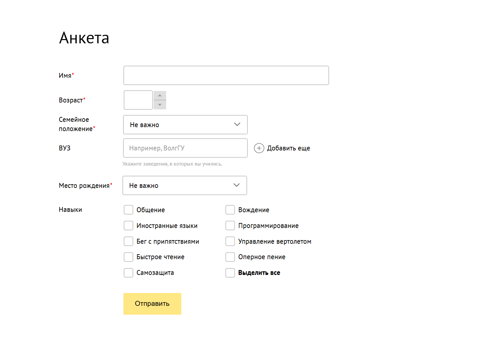
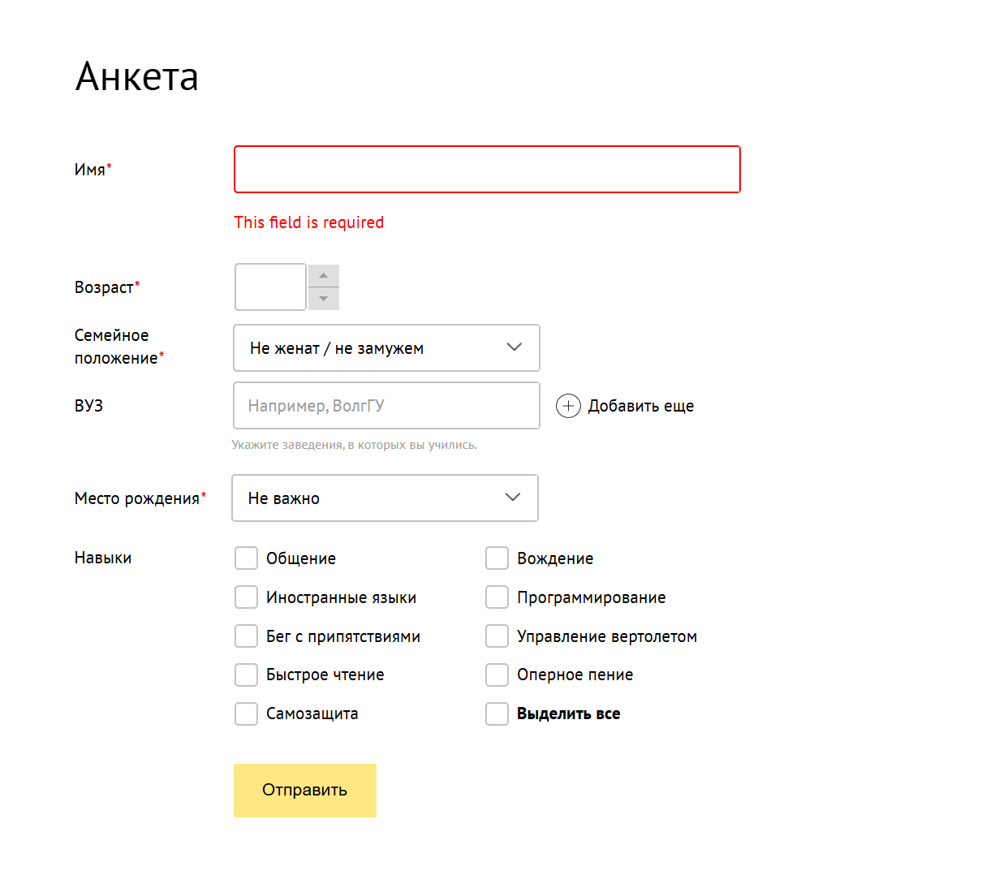

# Questionnaire (Form) for Company Background

# Table of contents

1. [Project Structure](#project-structure)
2. [Description and demo](#demonstration)
3. [Technologies](#technologies)
4. [Installing](#installing)
5. [Pre-requirements](#pre-requirements)
6. [Repository cloning](#repository-cloning)
7. [Using DI for errors customization](#example-of-error-customization-throw-di)
8. [Using token inside of pipe](#using-token-inside-of-pipe)
9. [Collecting settings inside of directive](#collecting-the-settings-inside-of-directive)
10. [Using token inside the component](#using-inside-of-component)
11. [Conclusion](#conclusion)
12. [Image/video representations](#arrow-pressing-responsibility)


## Project structure
```plaintext
test-taask/
├── src/
├── @global/
│   ├── styles.scss
│   ├── styles/
│   ├── other/
│   │   ├── other/
│   │   ├── anomations/
│   │   ├── decorators/
│   │   ├── funtions/
│   │   ├── tokens/
│   │   ├── abstract/
│   ├── app/
│   │   ├── components/
│   │   │   ├── inputs/
│   │   │   │   ├── select/
│   │   │   │   ├── select.component.ts
│   │   │   │   ├── select.component.html
│   │   │   │   ├── select.component.scss
│   │   │   │   └── select.component.spec.ts
│   │   │   ├── password-opener/
│   │   │   │   ├── password-opener.component.ts
│   │   │   │   ├── password-opener.component.html
│   │   │   │   ├── password-opener.component.scss
│   │   │   │   └── password-opener.component.spec.ts
│   │   │   └── ...
│   │   ├── directives/
│   │   ├── pipes/
│   │   ├── app.component.ts
│   │   ├── app.component.html
│   │   ├── app.component.scss
│   │   └── app.module.ts
│   ├── assets/
│   └── ...
├── angular.json
├── package.json
├── README.md
└── ...

```

## Description

This project is a **questionnaire (form)** developed using **Angular**.
The idea of the task is to create an interactive form,
which allows users to enter their data
and send them to the server or other final destination
ПThe project includes **custom components** such as `SelectComponent` and `StandardInputcomponent`,
providing improved user experience and functionality. Also in that project, quite superficially, ``DI - Dependency Injection`` is used,
which allows you to customize some places even more deeply, for example [validation errors](#example-of-error-customization-throw-di)

or for more flexible configuration of certain parts of components. Angular 18+ is used, so the examples contain a lot of function calls without arguments - signal calls
## Demonstration



*Interface example with using custom components*
## Technologies

- **Angular**: Framework for developing single-page applications.
- **TypeScript**: A programming language that extends the capabilities of JavaScript.
- **SCSS**: CSS preprocessor for improved styling.
- **Karma & Jasmine**: Tools for writing and running unit tests.
- **Angular CLI**: Command line tool to simplify development.
- 
## Other tools
- **Husky - git hooks**: to run git hooks before a commit and while installing dependencies
- **Lint Staged**: code verification before committing and during dependency installation
- **Style Lint**: checking if styles are correct
- **Prettier**: the code needs to be readable
- **Eslint**: a very flexible set of rules to keep your code clean
- **Commitlint**: utility for constructing correct commit messages (see [here](https://www.conventionalcommits.org/en/v1.0.0/))
## Installing
```bash
    npm i
    # if see errors
    npm i --force
```
### Pre-requirements

- **Node.js**: Make sure you have the latest LTS version of [Node.js](https://nodejs.org/).
- **Angular CLI**: Install Angular CLI globally if it is not already installed:

    ```bash
    npm install -g @angular/cli
    ```

### Repository cloning

```bash
git clone https://bitbucket.org/deprecated-ws/test-task
cd background-survey-form
```

### Example of error customization throw DI
```typescript
    // function for customizing validation errors
    // this function provides error records 
    // into the global container; they cannot be changed inside the component.
    provideFieldErrorsGlobally({
        required: 'This field is required',
        minLength: 'Minimal value length is 1 symbol',
        maxLength: 'Minimal value length is 22 symbols',
        requiredTrue: 'This field is required',
    }) 

    // DI token for getting error record
    export const FIELD_ERRORS = new InjectionToken<Record<string, string>>('FIELD_ERRORS'); 
    
    // function provider realisation
    export function provideFieldErrorsGlobally(errors: Record<string, string>): ApplicationConfig['providers'] {
        return [
            {
                provide: FIELD_ERRORS,
                useValue: errors,
            },
        ];
    }
```

### Using Token inside of pipe
```typescript
@Pipe({
    name: 'fieldError',
    standalone: true,
    pure: false,
    // in this case the use of impure is due to the fact that
    // what you need to "react" errors inside the component that displays them
})
export class FieldErrorPipe<T> implements PipeTransform {
    private readonly control = inject(NgControl, { optional: true });
    private readonly errors = inject(FIELD_ERRORS);
    transform(value: T[]): Observable<string[]> {
        if (!this.control || !(this.control.control instanceof FormControl)) {
            return of(value as string[]);
        }

        return this.control.control.statusChanges.pipe(
            startWith(this.control.control.status),
            map(() => {
                return [...this.getErrorsArray(this.control!.control!)];
            }),
        );
    }

    private getErrorsArray(control: AbstractControl): string[] {
        if (!control.errors) {
            return [];
        }

        return Object.keys(control!.errors!).map((key) => {
            return this.errors[key];
        });
    }
}
```
## Collecting the settings inside of directive
```typescript

// token and providers for setting up the input field. 
// did not add only the appearance setting - no meaning
export interface InputSettings {
    textFieldCleaner?: boolean;
    textFieldAutofocus?: boolean;
    textFieldPasswordOpener?: boolean;
}

export const INPUT_SETTINGS = new InjectionToken<InputSettings>('INPUT_SETTINGS', {
    providedIn: 'root',
    factory: (): InputSettings => ({}),
});

export function provideInputSettings(settings: InputSettings): Provider {
    return {
        provide: INPUT_SETTINGS,
        useValue: settings,
    };
}

// directive that will install everything. It is used as a service 
// because it was easier and faster than creating a service and then dragging it everywhere, 
// where we need to change something
@Directive({
    selector: '[inputSettings],[textFieldCleaner],[textFieldAutofocus],[textFieldPasswordOpener]',
    standalone: true,
})
export class InputSettingsDirective implements OnInit {
    settings = inject(INPUT_SETTINGS);
    readonly textFieldCleaner = input<boolean>();
    readonly textFieldAutofocus = input<boolean>();
    readonly textFieldPasswordOpener = input<boolean>();

    ngOnInit(): void {
        this.settings = {
            textFieldCleaner: this.textFieldCleaner(),
            textFieldAutofocus: this.textFieldAutofocus(),
            textFieldPasswordOpener: this.textFieldPasswordOpener(),
        };
    }
}

```

## Using inside of component
```typescript
@Component({
    selector: 'app-standard-input',
    standalone: true,
    imports: [
        ReactiveFormsModule,
        FormsModule,
        JsonPipe,
        ButtonComponent,
        TextFieldCleanerComponent,
        PasswordOpenerComponent,
    ],
    templateUrl: './standard-input.component.html',
    styleUrls: ['./standard-input.component.scss'],
    changeDetection: ChangeDetectionStrategy.OnPush,
    providers: [provideAsControl(StandardInputComponent)],
})
export class StandardInputComponent<T = number | string> extends Control<T> {
    readonly type = input<'text' | 'email' | 'password' | 'number'>('text');
    readonly settings = signal(inject(InputSettingsDirective));
    readonly nativeInput = viewChild<ElementRef<HTMLInputElement>>('nativeInput');

    readonly cleaner = computed(() => this.settings().settings.textFieldCleaner);
    readonly autofocus = computed(() => this.settings().settings.textFieldAutofocus);
    readonly passwordOpener = computed(() => this.settings().settings.textFieldPasswordOpener);
    //other code you can to see in the StandardInputComponent
}
```
## Conclusion
Although I may not yet fully understand the depth of dependency injection in Angular, I aimed to demonstrate some of its capabilities. DI in this project allows for minimal customization, but it has the potential for much broader, impactful use cases.

## Image/Video Representations
Handling Keyboard Events (Arrow, Escape, Enter)


## if we want to emit keydown event, select dropdown react to that


### Behaviors
1. ArrowUp:

* Behavior: When the ArrowUp key is pressed, the selected index in the dropdown list moves upward by 1.
* Logic:
The selected index is decremented by 1 ```(current - 1)```.
If the index reaches the beginning (index 0), pressing ArrowUp again wraps the selection to the last item in the list.
Outcome: The item at the new selected index is highlighted.

2. ArrowDown:

* Behavior: When the ArrowDown key is pressed, the selected index moves downward by 1.
* Logic:
The selected index is incremented by 1 (current + 1).
If the index reaches the end of the list, pressing ArrowDown again wraps the selection to the first item (index 0).
* Outcome: The item at the new selected index is highlighted.
3. Enter: 
* Behavior: When the Enter key is pressed, the item currently highlighted by the selected index is chosen.
* Logic:
The selected item’s value is saved as the chosen item.
The dropdown menu closes, and the chosen item is displayed in the input field.
* Outcome: The user’s selection is confirmed, and the dropdown closes.
* Income: if dropdown state is closed - dropdown changing state into open
4. Escape:
* Behavior: When the Escape key is pressed, the dropdown menu closes without selecting any new item.
* Logic:
Any highlight on the selected index is removed.
The dropdown is set to a closed state.
* Outcome: The dropdown closes, discarding any pending selections or changes. 
## Form validation



## And now we have a normally working example of the minimal ui-kit in this form component

# Thanks!

